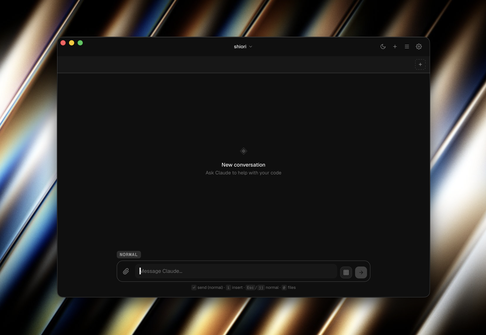

# Mensa

A GUI wrapper and IDE for [Claude Code](https://github.com/anthropics/claude-code) - Anthropic's CLI for Claude.



## Features

- Chat interface for Claude Code conversations
- Session management - load and resume previous conversations
- File attachment support (images, documents)
- Tool execution visualization
- Markdown rendering with syntax highlighting
- Code diff viewer
- Command palette
- Settings management for MCP servers and permissions

## Installation

Download the latest release for your platform from the [Releases](https://github.com/FujiwaraChoki/mensa/releases) page.

### Supported Platforms

- macOS (Apple Silicon & Intel)
- Windows
- Linux

## Development

### Prerequisites

- [Bun](https://bun.sh/)
- [Rust](https://www.rust-lang.org/tools/install)
- [Tauri CLI](https://tauri.app/v1/guides/getting-started/prerequisites)

### Setup

```bash
# Install dependencies
bun install

# Run in development mode
bun run tauri dev

# Build for production
bun run tauri build
```

## License

This project is licensed under the **MIT License with Commons Clause**.

You are free to use, modify, and distribute this software for non-commercial purposes. Commercial use (selling the software or offering paid services based on it) requires a commercial license from the author.

See [LICENSE](LICENSE) for details.

**Author:** Sami Hindi (sami@samihindi.com)

## Contributing

Contributions are welcome! Please read [CONTRIBUTING.md](CONTRIBUTING.md) for guidelines.
